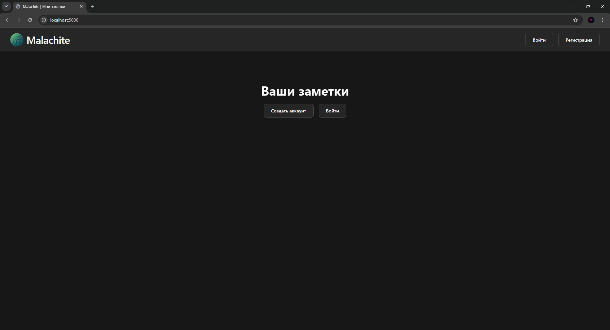
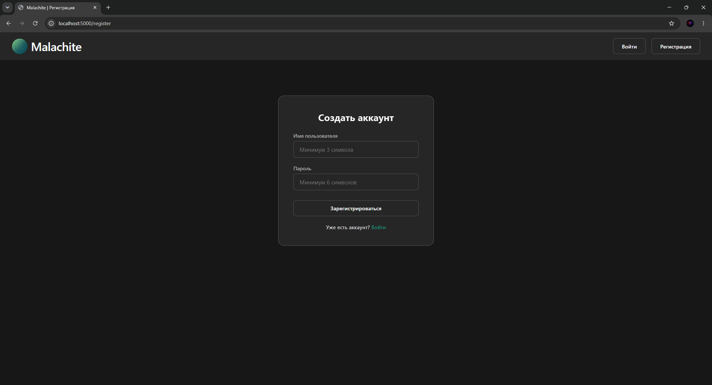
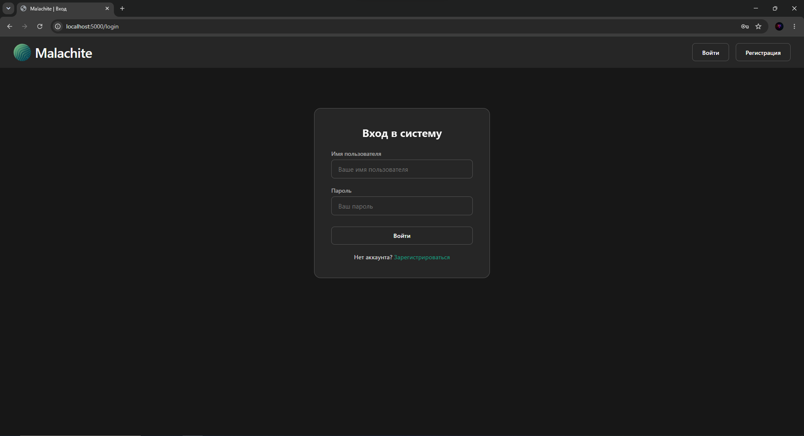
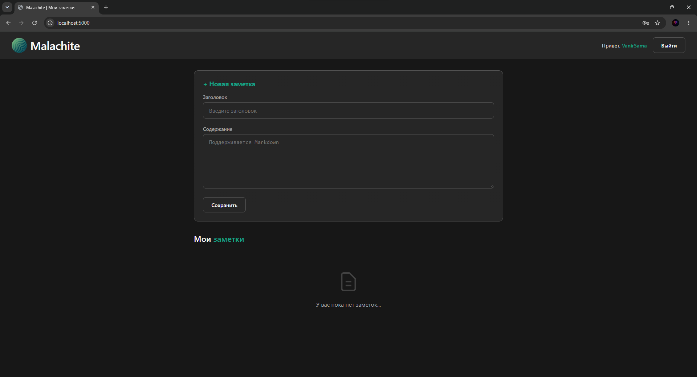
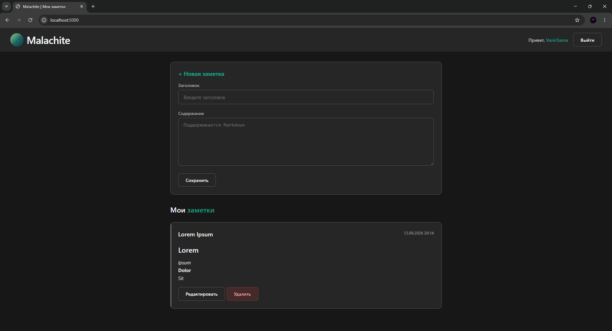
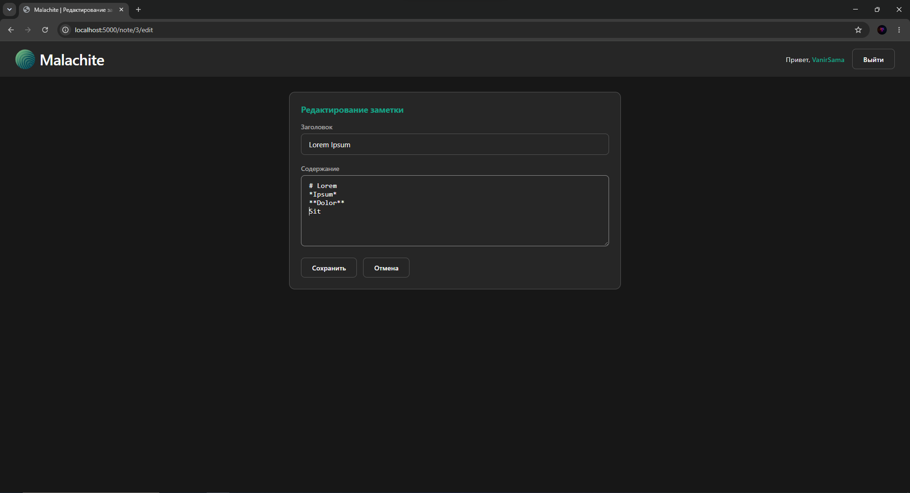
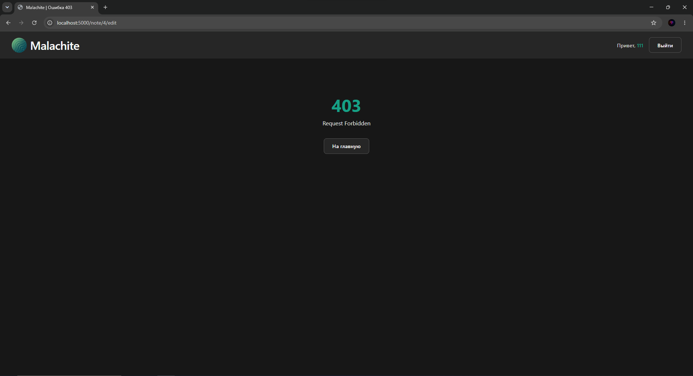

# Практическая работа №1

---
Исходный код Python [web-приложения](../src).

---

Главная страница приложения:

Регистрация:

Вход в систему:

Главная страница авторизованного пользователя:

Заметки:

Редактирование заметки:

Попытка эксплуатации IDOR за другого авторизованного пользователя:

